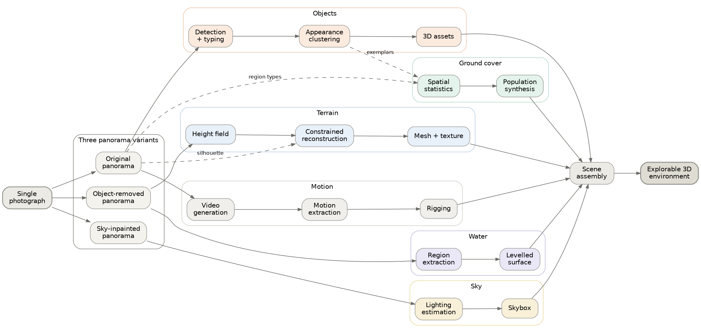

# Brief: `pipeline-overview.pdf`

Source material for generating the pipeline figure in `main.tex` (`\label{fig:pipeline}`).

> **Superseded.** The figure is now drawn directly:
> `pipeline-overview.tex` (TikZ, what the report uses) and
> `make_pipeline_figure.py` (matplotlib, the fallback image). This file is kept
> only as the written spec of *what the diagram says* — useful if you want to
> regenerate it a different way, or hand it to someone else.

Two things are provided:

1. **A prompt** (§1–§5) written for a generative diagram tool such as paper-banana.
2. **A deterministic fallback** (§6) — Graphviz source encoding the same graph
   exactly.

Read §0 first; it explains why both exist.

---

## 0. Read this before generating

The real pipeline has **40 active stages**. A 40-node diagram rendered by an image
model will almost certainly come back with garbled or invented text — technical
diagrams are the case these models are weakest at, and label fidelity is exactly
what a pipeline figure needs.

So the prompt below deliberately describes **13 grouped blocks, not 40 stages**.
The grouping is real (it matches the tracks in `\cref{tab:stages}`), and 13 blocks
is roughly the ceiling for a figure that stays readable at column width in a
20-page report.

**Verify every label against §4 before shipping the result.** If more than one or
two are wrong, use the Graphviz fallback in §6 — it cannot get labels wrong.

---

## 1. What the figure has to communicate

One claim, in priority order:

1. **A single photograph fans out into five parallel reconstruction tracks**, each
   producing a different kind of scene component, which are then reassembled into
   one explorable environment. The fan-out and reassembly is the shape of the
   figure.
2. **Three different versions of the panorama exist**, and different consumers
   deliberately read different ones. This is the single most counter-intuitive
   thing about the architecture and the figure should make it visible.
3. Geometry flows one way; semantics flow alongside it. These should be
   visually distinct (solid vs dashed).

If the layout forces a trade-off, keep (1) and (2) and let (3) go.

---

## 2. Prompt

> A clean, technical pipeline diagram for a computer-graphics research paper.
> Horizontal left-to-right flow. Flat vector style, no gradients, no drop shadows,
> no 3D, no skeuomorphism. White background. Thin (1pt) connector lines with small
> arrowheads. Rounded rectangles with thin borders and generous internal padding.
> Sans-serif labels, all the same size except the group headings, which are
> slightly larger and set in small caps.
>
> The diagram is organised in five horizontal bands, labelled on the far left:
> **INPUT**, **PANORAMA**, **TRACKS**, **ASSEMBLY**, **OUTPUT**.
>
> On the left, a single small box labelled "Single photograph" feeds rightward
> into a band of three stacked boxes labelled "Original panorama",
> "Object-removed panorama" and "Sky-inpainted panorama". These three are visually
> grouped inside one lightly-tinted container labelled "Three panorama variants".
>
> From that container, arrows fan out to the right into five parallel horizontal
> lanes, each a chain of two or three boxes. Each lane is tinted a different pale
> colour and has a heading on its left:
>
> - **Terrain** lane: "Height field" -> "Constrained reconstruction" -> "Mesh + texture"
> - **Objects** lane: "Detection + typing" -> "Appearance clustering" -> "3D assets"
> - **Ground cover** lane: "Spatial statistics" -> "Population synthesis"
> - **Water** lane: "Region extraction" -> "Levelled surface"
> - **Sky** lane: "Lighting estimation" -> "Skybox"
>
> The five lanes converge on the right into a single box labelled "Scene assembly",
> which feeds one final box labelled "Explorable 3D environment" drawn slightly
> larger and with a heavier border than the rest.
>
> Below the lanes, a separate narrow lane labelled **Motion** contains
> "Video generation" -> "Motion extraction" -> "Rigging", joining the
> "Scene assembly" box from underneath.
>
> Two arrow styles: solid arrows for geometry and assets, dashed arrows for
> semantic information (region types, labels, scene tags). Include a small legend
> in the lower-left corner defining the two.
>
> No text anywhere except the labels named above. No icons, no logos, no
> decorative imagery, no photographs.

---

## 3. Follow-up prompts if the first pass is close but wrong

Use these one at a time rather than regenerating from scratch:

- "Keep the layout identical but make all label text larger and increase the
  spacing between the five lanes."
- "Remove every text element that is not one of these exact strings: [paste §4]."
- "Make the three panorama boxes visually distinct from the lane boxes — give the
  container a visible border and a caption."
- "Straighten all connectors to horizontal or right-angled paths; remove curves."

---

## 4. Exact label list — nothing else should appear

Band headings: `INPUT` · `PANORAMA` · `TRACKS` · `ASSEMBLY` · `OUTPUT`

```
Single photograph
Three panorama variants
  Original panorama
  Object-removed panorama
  Sky-inpainted panorama
Terrain        Height field · Constrained reconstruction · Mesh + texture
Objects        Detection + typing · Appearance clustering · 3D assets
Ground cover   Spatial statistics · Population synthesis
Water          Region extraction · Levelled surface
Sky            Lighting estimation · Skybox
Motion         Video generation · Motion extraction · Rigging
Scene assembly
Explorable 3D environment
Legend: geometry (solid) · semantics (dashed)
```

---

## 5. The architectural facts the diagram encodes

Provide these if the tool accepts context beyond the prompt. They are the reason
the figure is shaped the way it is, and all are verified against the code.

**Three panorama variants, routed deliberately.** The pipeline maintains three,
and the routing is not an implementation detail — it is load-bearing:

| Variant | Produced by | Consumed by |
|---|---|---|
| `panorama` (original) | outpainting + super-resolution | object segmentation, recognition, detection, instance refinement, video generation, video tracking, **and the region typing used for semantics** |
| `panorama_terrain` (object-removed) | foreground inpainting, then equirectangular LoRA correction | panoramic depth, **the region typing used for terrain geometry** |
| `panorama_sky` (sky-inpainted) | skybox inpainting | scene assembly / skybox |

The reason: foreground inpainting removes everything closer than a threshold,
which in a ground-level capture is the ground itself across the whole lower
hemisphere. Geometry must come from the object-removed panorama or occluders
punch holes in the ground; semantics must come from the original or the evidence
has been erased.

**Two independent region typings** are run over the two panoramas, producing two
parallel sets of region maps. This is why the semantics arrows are worth drawing
separately.

**Track lengths in the real pipeline** (grouped in the figure):
terrain 8 stages, objects 7, ground cover 3, water folded into terrain meshing,
sky 2, motion 5.

**Convergence point.** Scene assembly is the only stage that reads from every
track. Everything upstream is independent given the panoramas.

---

## 6. Deterministic fallback — Graphviz

Renders to PDF directly and cannot get a label wrong:

```bash
dot -Tpdf pipeline-overview.dot -o pipeline-overview.pdf
```



The same source is already extracted to **`pipeline-overview.dot`** in this
folder, so you can render it without copy-pasting.

21 nodes, 7 clusters, 27 edges. Structure verified (balanced braces and brackets,
every node used in an edge is declared, no orphans); it has **not** been rendered,
because Graphviz was not available on the machine this was written on. The graph
itself is derived from `server/config.yaml` and the `ContextKey` reads/writes in
`server/pipeline/`.

---

## 7. If you want the full 40-stage version instead

`docs/pipeline-diagram.svg` is an existing hand-authored SVG of the complete
stage list. It is too dense for a body figure at column width, but works as an
appendix figure on its own page. To use it:

```bash
# vector, preferred
rsvg-convert -f pdf -o figures/pipeline-full.pdf docs/pipeline-diagram.svg
# or via inkscape
inkscape docs/pipeline-diagram.svg --export-filename=figures/pipeline-full.pdf
```

Then add to `sections/03-method-overview.tex` as a `figure*` on its own page.
